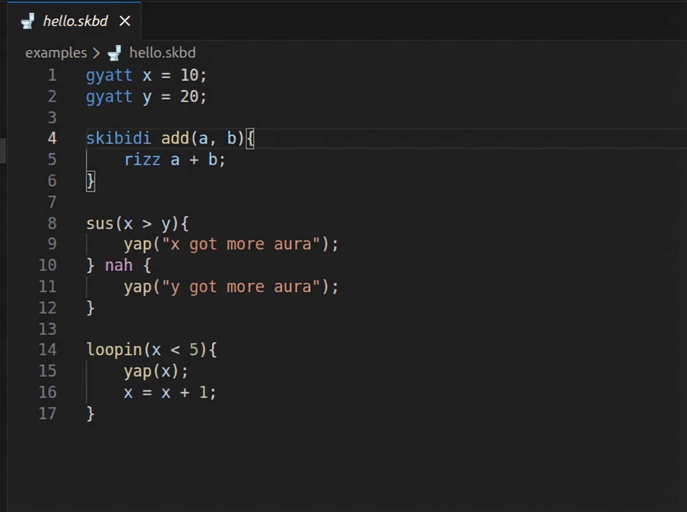

# Skibidi Lang

A Gen-Z programming language with zero cap syntax and full LLVM rizz.


> It's not meant for production, it's just for fun.

## Syntax

```skibidi
    gyatt x = 10;
    gyatt y = 20;

    skibidi add(a, b){
        rizz a + b;
    }

    sus(x > y){
        yap("x got more aura");
    } nah {
        yap("y got more aura");
    }

    loopin(x < 5){
        yap(x);
        x = x + 1;
    }
```


## Features
- LLVM-based compiler
- Simple syntax
- Expressions, variables, functions (WIP)
- REPL (planned)

## Screenshots



### Made with 🗿 by [Sudip Mahata](https://imsudip.is-a.dev)
